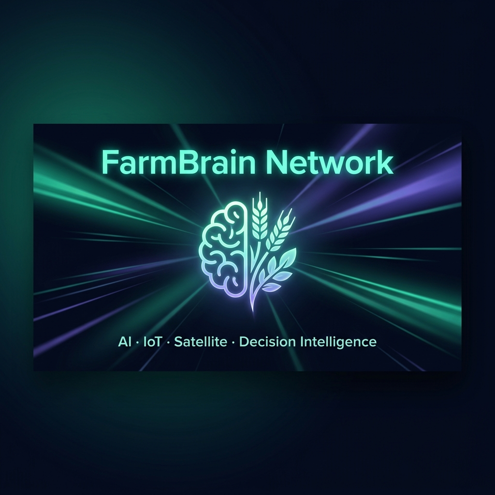
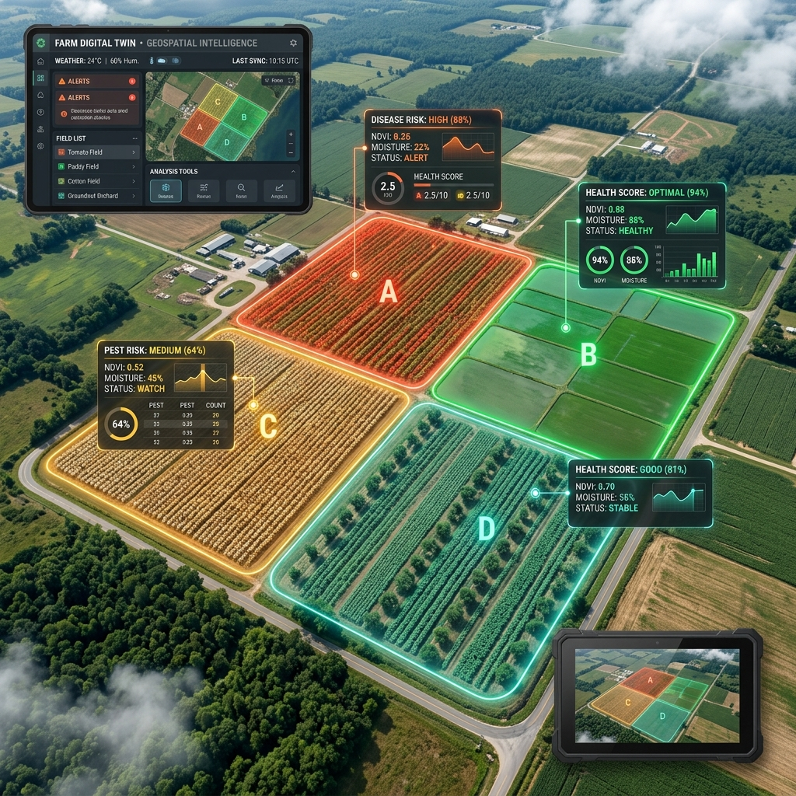
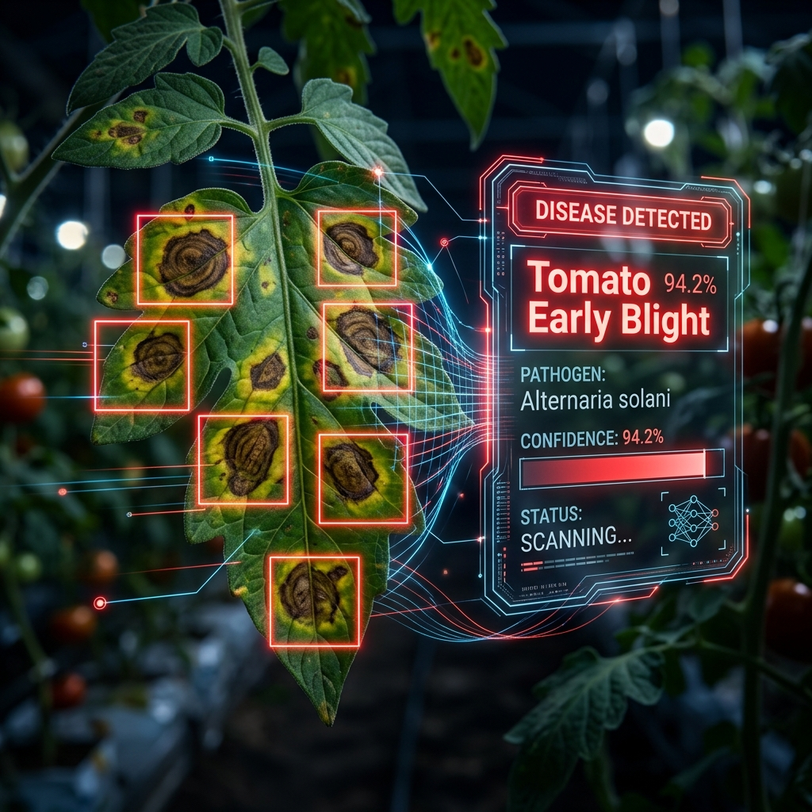
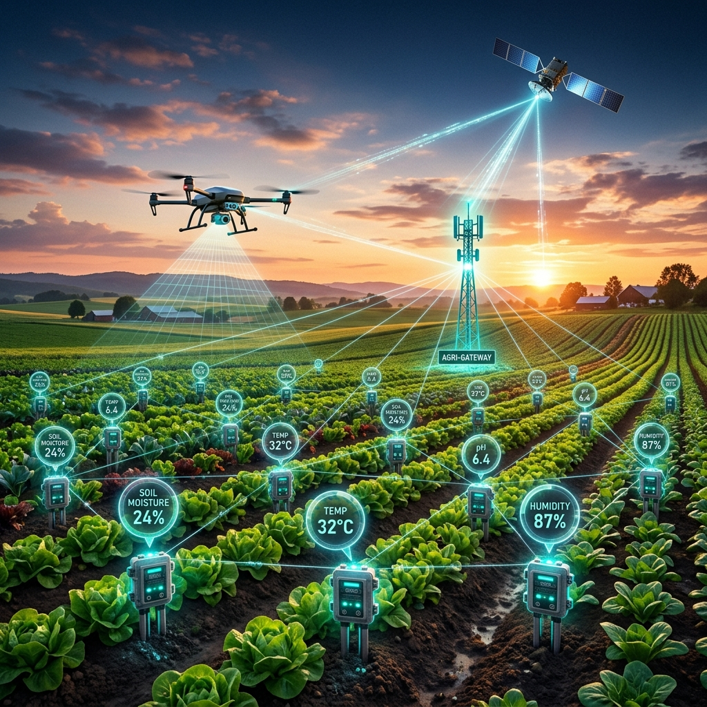
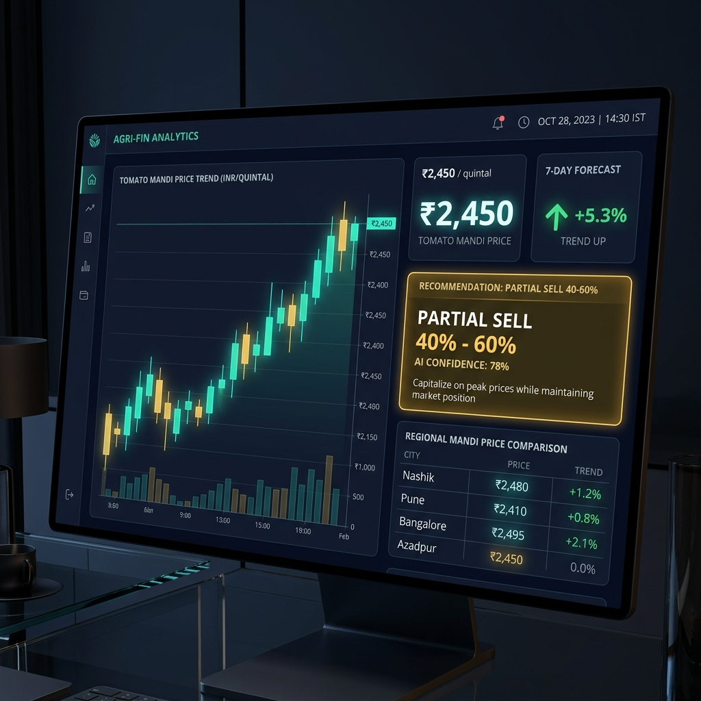

# FarmBrain Network — Complete AI + IoT + Satellite + Decision Intelligence System

<p align="center">
  
</p>

<p align="center">
  <a href="https://github.com/vijaymahes9080/FarmBrain-Network/blob/main/LICENSE"></a>
  
  
  
  
  
</p>

> **FarmBrain Network** is an AI-powered agricultural decision-intelligence platform that integrates IoT sensors, satellite imagery, drone data, weather forecasts, market intelligence, and computer vision to continuously monitor farm conditions, predict agricultural risks, recommend optimal actions, and automate selected farming operations.

---

## 🏗️ 1. Complete Intelligence Pipeline Architecture

```text
                 ┌─────────────────────┐
                 │       FARM          │
                 │ Crops + Soil + Water│
                 └──────────┬──────────┘
                            │
          ┌─────────────────┼─────────────────┐
          ↓                 ↓                 ↓
     IoT Sensors          Drone          Satellite
          │                 │                 │
          └─────────────────┼─────────────────┘
                            ↓
                 ┌─────────────────────┐
                 │   FARM DATA HUB     │
                 │ MQTT + API + Cloud  │
                 └──────────┬──────────┘
                            ↓
                 ┌─────────────────────┐
                 │   FARMBRAIN AI      │
                 │ Intelligence Engine │
                 └──────────┬──────────┘
                            │
       ┌──────────┬─────────┼─────────┬──────────┐
       ↓          ↓         ↓         ↓          ↓
    Disease    Weather     Pest     Irrigation  Market
      AI         AI         AI         AI         AI
       │          │         │         │          │
       └──────────┴─────────┼─────────┴──────────┘
                            ↓
                 ┌─────────────────────┐
                 │ DECISION ENGINE     │
                 │ "What should farmer │
                 │ do now?"            │
                 └──────────┬──────────┘
                            ↓
             ┌──────────────┴──────────────┐
             ↓                             ↓
       FARMER ALERT                  AUTOMATION
       Mobile/Web App                Pump / Valve
             │                             │
             └──────────────┬──────────────┘
                            ↓
                    FARM ACTION
                            │
                            ↓
                    New Sensor Data
                            │
                            └──────→ AI (Closed-Loop Learning)
```

---

## 🧠 2. The "Brain" of FarmBrain — Decision Intelligence

Instead of displaying raw monitoring values, **FarmBrain Network** converts raw telemetry into actionable decision intelligence:

| Raw Sensor Input | Standard App | FarmBrain Decision Intelligence Output |
|---|---|---|
| Soil Moisture = 24%, Rain Prob = 75% | Soil Moisture = 24% | **"Delay irrigation today. Expected rainfall (75%) will fulfill crop water requirements."** |
| Humidity = 87%, Temp = 32°C | Humidity = 87% | **"High fungal-disease risk (Tomato Early Blight - 94% Confidence). Inspect Zone A within 12 hours."** |
| Spot Price = ₹2,450, 7-Day Trend = ↑ | Market price = ₹2,450 | **"Current price is favorable. Expected 7-day trend is positive. Consider selling 40–60% of harvested stock."** |

---

## 🗺️ 3. Farm Digital Twin & Spatial GIS

<p align="center">
  
</p>

> The **Digital Twin** divides the farm into interactive spatial zones. Click any zone to view live sensor telemetry, Sentinel-2 NDVI satellite data, 4K drone scan imagery, disease probability, pest risk, and zone-specific AI recommendations.

---

## 🦠 4. Leaf Disease Computer Vision Classifier

<p align="center">
  
</p>

**CV Pipeline:** `Leaf Image` → `ResNet50 + YOLOv8` → `Disease Classification` → `Confidence Score` → `Farmer Alert`

| Detection | Confidence | Severity | Action |
|---|---|---|---|
| Tomato Early Blight | 94.2% | HIGH | Apply Mancozeb @ 2.5g/L |
| Paddy Blast Disease | 88.5% | MEDIUM | Spray Tricyclazole @ 0.6g/L |
| Cotton Aphid Infestation | 91.0% | HIGH | Deploy Imidacloprid @ 0.5ml/L |

---

## 📡 5. IoT + Drone + Satellite Sensing Layer

<p align="center">
  
</p>

| Sensing Layer | Technology | What it provides |
|---|---|---|
| 🌐 **Satellite** | Sentinel-2 L2A | NDVI, EVI, crop stress, large-area monitoring |
| 🚁 **Drone** | DJI Mavic 3 Multispectral | Leaf disease, crop gaps, 4K thermal imaging |
| 📡 **IoT Ground** | ESP32 + LoRaWAN | Soil moisture, temperature, humidity, pH, water level |
| 🤖 **AI Engine** | PyTorch + YOLOv8 | Combines all 3 layers into closed-loop decisions |

---

## 💰 6. Market Intelligence Engine

<p align="center">
  
</p>

**Holt-Winters ARIMA + LSTM time-series model** forecasting APMC mandi prices with Sell/Hold AI recommendation engine.

---

## 🌱 7. Major Intelligence Modules

| Module | Function | Algorithm |
|---|---|---|
| 🌱 **01 — Crop Intelligence** | Biomass health, yield forecast, NDVI stress | Sentinel-2 Band Math, Vegetation Index |
| 🦠 **02 — Disease Prediction** | Leaf pathogen CV classification | ResNet50 + YOLOv8 CNN Inference |
| 🌦️ **03 — Weather Intelligence** | Micro-climate 7-day farm warnings | OpenWeather API + Sensor Fusion |
| 💧 **04 — Smart Irrigation** | Rain-lock override, ET0 water demand | FAO-56 Penman-Monteith Equation |
| 🐛 **05 — Pest Intelligence** | Pest outbreak early warning | Growing Degree Days (GDD) Model |
| 💰 **06 — Market Intelligence** | Mandi price forecast, Sell/Hold | Holt-Winters + ARIMA Forecasting |
| 🗺️ **Digital Twin** | Spatial zone GIS intelligence | Sentinel-2 NDVI + Leaflet Maps |

---

## 🛠️ 8. Technology Stack

| Layer | Technology |
|---|---|
| **Frontend Framework** | React 18 + Vite |
| **Styling & Design System** | Custom Vanilla CSS (Dark Theme + Glassmorphism) |
| **Visualization & Charts** | Recharts |
| **Micro-Animations** | Framer Motion |
| **Spatial Maps** | Leaflet + React-Leaflet |
| **Icons** | Lucide React |
| **Backend Architecture** | Python FastAPI (Simulated Telemetry API) |
| **Spatial Database** | PostgreSQL + PostGIS |
| **Hardware Nodes** | ESP32 Microcontrollers (Soil Moisture, Temp, Solenoids) |
| **Communication Protocol** | MQTT / LoRaWAN |
| **Satellite Imagery** | Sentinel-2 L2A via Copernicus |
| **Disease Vision AI** | YOLOv8 + ResNet50 (PlantVillage Dataset) |
| **Market Forecasting** | Holt-Winters + ARIMA/LSTM |
| **Container & Deploy** | Docker + Linux |

---

## 💻 9. Installation & Running Locally

### Prerequisites
- Node.js (v18 or higher)
- npm or yarn

### Steps

1. **Clone the repository:**
   ```bash
   git clone https://github.com/vijaymahes9080/FarmBrain-Network.git
   cd FarmBrain-Network
   ```

2. **Install dependencies:**
   ```bash
   npm install
   ```

3. **Start the development server:**
   ```bash
   npm run dev
   ```

4. **Build for production:**
   ```bash
   npm run build
   ```

---

## 👤 10. Developer Info & License

- **Developer:** Vijay Mahes
- **Email:** Vijaypradhap2004@gmail.com
- **Repository:** [GitHub — vijaymahes9080/FarmBrain-Network](https://github.com/vijaymahes9080/FarmBrain-Network.git)
- **Project:** MCA Final Year Project — FarmBrain Network Decision Intelligence System
- **License:** Distributed under the [MIT License](LICENSE).
